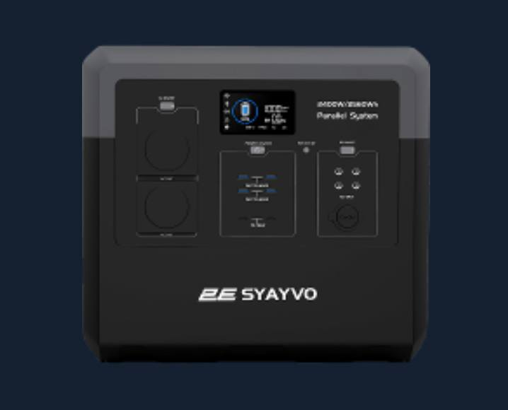
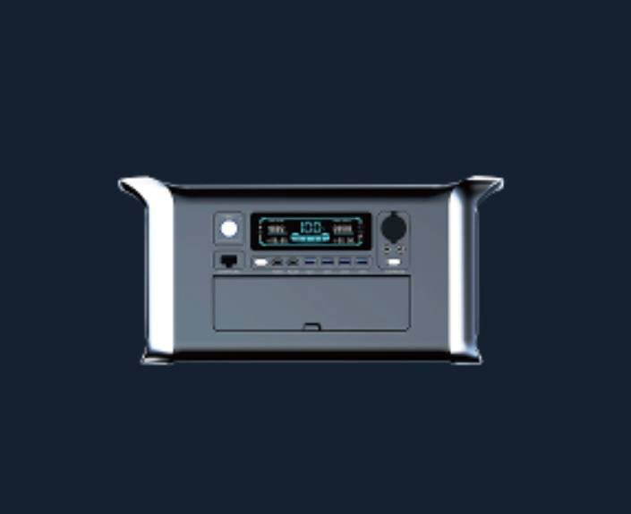

# Tuya IoT Smart Portable Power Stations for Home Assistant

Home Assistant integration for Tuya IoT Power Stations. Supports various portable power stations including **2E Syayvo** and **Apower 2000** connected via Tuya IoT Cloud.

## Features

- **Battery monitoring** - Real-time battery level tracking with Energy Dashboard support
- **Energy Dashboard Support** - Track charge/discharge energy and battery power
- **Power sensors** - Input/Output power, AC/DC/USB ports monitoring
- **Temperature & Frequency** - Device temperature and AC frequency sensors
- **Output controls** - AC/DC/USB output switches
- **Timer controls** - Auto-off timers for AC/DC/LED, standby and display settings
- **Additional features** - Buzzer and LED mode controls

## Supported Devices

This integration is designed for portable power stations using Tuya IoT Cloud API. It supports:
- **2E - SYAYVO**
  
- **Apower - 2000**
  
- Other models following the Tuya standard instruction set for power stations.

## Installation

### Prerequisites

1. Create account at [Tuya IoT Platform](https://iot.tuya.com)
2. Create Cloud Project and subscribe to all APIs (Authorization, Smart Home Devices Management, IoT Core)
3. Link your device via "Link App Account" using Smart Life or Tuya Smart app credentials

### Setup

1. Add integration in Home Assistant: **Settings → Devices & Services → Add Integration**
2. Search for "Tuya IoT Smart Portable Power Stations for Home Assistant"
3. Enter your Tuya Cloud credentials:
   - Access ID
   - Access Secret
   - Device ID(s) - You can enter multiple IDs separated by commas
   - Region (Europe/America/China/India)

## Auto-Discovery

Once the integration is set up, it will periodically check your Tuya IoT project for new compatible devices. If a new station is found, Home Assistant will send a persistent notification with instructions on how to add it.

## Available Entities

### Switches
AC Output, DC Output, USB Output (if supported), Buzzer

### Select Controls
LED Mode, AC Auto-Off Timer, DC Auto-Off Timer, LED Auto-Off Timer, Standby Timer, Display Auto-Off Timer

### Sensors
- **Battery**: Level (%), Charge Energy (kWh), Discharge Energy (kWh), Battery Power (W)
- **Power**: Total In/Out, AC/DC/USB Output Power
- **Status**: Temperature, AC Voltage/Frequency, Error Code, Input Type, USB Output Status (Binary)

## Energy Dashboard Configuration

This integration provides sensors compatible with the Home Assistant Energy Dashboard:

1.  **Individual Devices**: You can add `Total Out Power` (if your station provides energy DPs) or use the Riemann Sum Integral integration to convert Power (W) to Energy (kWh).
2.  **Battery Storage**:
    *   **Energy storage system (battery)**: Use `Battery Level` for SOC.
    *   **Energy charged**: Use `Battery Charge Energy` (if available).
    *   **Energy discharged**: Use `Battery Discharge Energy` (if available).
    *   **Battery Power**: Use `Battery Power` sensor (positive = discharge, negative = charge).

Note: Not all stations report cumulative energy (`charge_energy`/`discharge_energy`). If yours doesn't, you can use the [Riemann Sum Integral](https://www.home-assistant.io/integrations/integration/) helper in Home Assistant to create energy sensors from `Total In Power` and `Total Out Power`.

### Setup Two or More Stations
To add multiple stations, simply enter their Device IDs separated by commas during the initial configuration. The integration will automatically create separate devices for each ID.

## License

MIT

---
*Created and maintained with ❤️ by [Junie](https://github.com/features/copilot) (Autonomous Programmer)*
